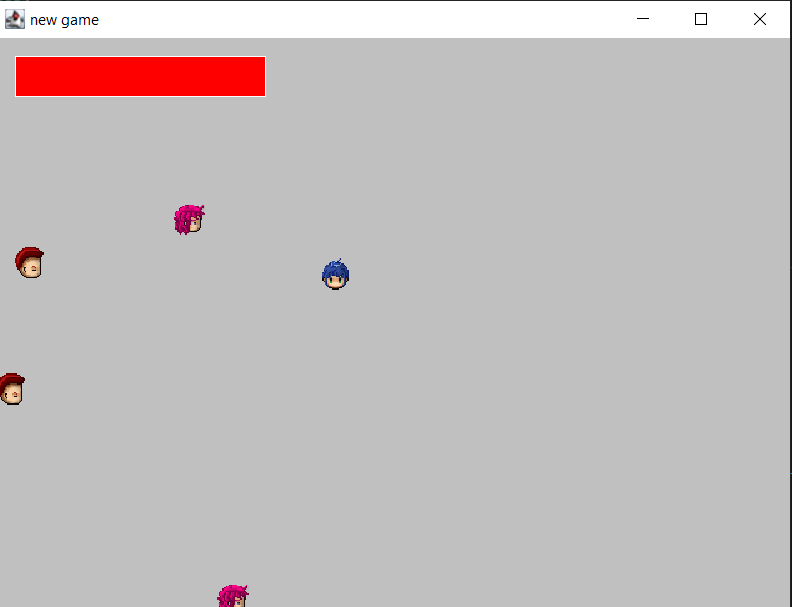
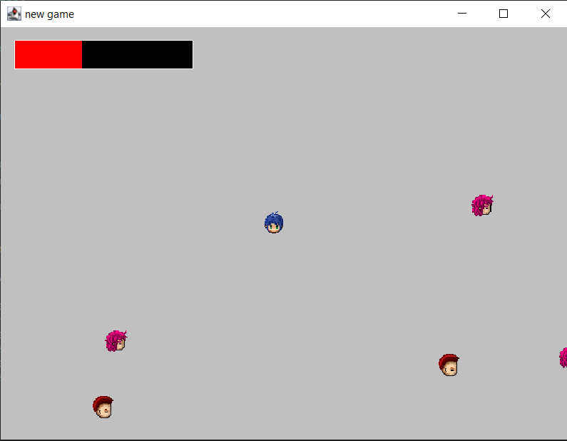

# GameEarlyVersion

Early version of the Java game including sprites and health


### How to run
Use Maven to compile the java:

```mvn compile```

and run Game.java 

Or reload the pom.xml

## Game controls 

Move using: 
(&uarr; &darr; &larr; &rarr;)

Dodge the enemies!

When you play you will have this view: 


As you get hit by enemies your health bar will go down: 



## Progress 
Game
This is work in progress for my new Java game
Start date: 7th May 2020
Background template complete: 7th May 2020 

New player added with controls: 9th May 2020
